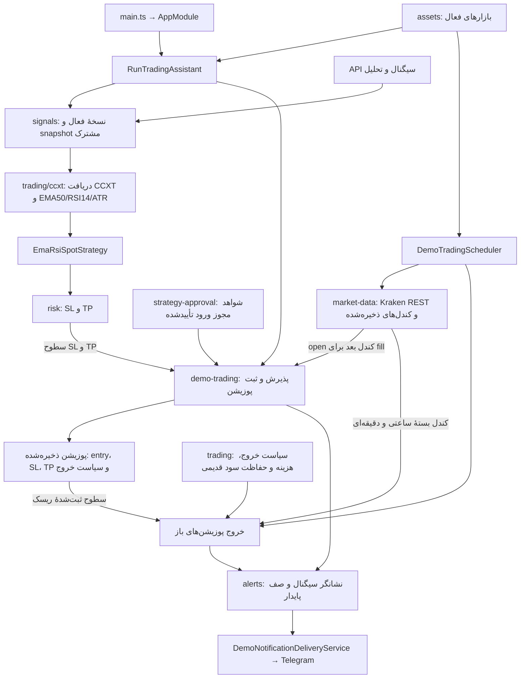

# ارتباط بخش‌های production

در بررسی فعلی، هر ۵۷ فایل TypeScript از `main.ts` مسیر وابستگی دارد. پوشهٔ خالی، فایل خارج از منابع برنامه یا فایل جداافتاده پیدا نشد. کنترل ساختار این موارد را بررسی می‌کند و تست راه‌اندازی آفلاین Nest هم اتصال سرویس‌ها و همان ۱۹ route فعال را تأیید می‌کند.

## چرخهٔ تحلیل و اجرا

`SignalsService` تحلیل CCXT را می‌گیرد؛ `EmaRsiSpotStrategy` نتیجه را به سیگنال دارای سطوح ریسک تبدیل می‌کند. runner فقط snapshot معتبر را به دمو می‌دهد. خواندن open کندل بعد برای قیمت ورود از Kraken REST انجام می‌شود؛ آن کندل وارد ورودی اندیکاتورها نمی‌شود. دادهٔ ذخیره‌شده نیز برای کیفیت تاریخچه و بررسی خروج لازم است. وجود این دو مسیر دریافت به معنی وجود دو استراتژی تصمیم نیست.

## نقش هر پوشه

| پوشه | نقش در چرخه |
| --- | --- |
| `assets` | انتخاب بازار فعال برای runner و زمان‌بند؛ API مدیریت همین تنظیمات |
| `signals` | نسخهٔ فعال، دریافت snapshot و ارائهٔ تصمیم/توضیح همان تحلیل به API |
| `trading/ccxt` | دریافت و اعتبارسنجی OHLCV، هستهٔ اندیکاتورها، cache و حلقهٔ ورود |
| `risk` | SL و TP برای سیگنال قابل ورود |
| `trading` | تبدیل تحلیل به سیگنال، تطبیق قیمت ورود، هزینه، حجم و قواعد خروج |
| `demo-trading` | پذیرش سرمایه، ثبت اتمیک پوزیشن، خروج، خلاصهٔ نتیجه و ارسال اعلان |
| `market-data` | دریافت REST، نگهداری کندل بسته، کیفیت، sync، ترمیم و قیمت open برای fill |
| `strategy-approval` | خواندن شواهد ذخیره‌شده برای ورود در حالت APPROVED؛ بک‌تست اجرا نمی‌کند |
| `alerts/entities` | مدل جدول `alert_delivery` که runner، تراکنش پوزیشن و dispatcher استفاده می‌کنند |

همهٔ این فایل‌ها اندیکاتور محاسبه نمی‌کنند. DTOها ورودی API، entityها دادهٔ پایدار، ماژول‌ها اتصال Nest و قراردادهای شواهد شرط مجوز ورود را پشتیبانی می‌کنند. حذف آن‌ها بخشی از چرخهٔ فعال را قطع می‌کند. فایل‌های سیاست خروج قدیمی نیز برای سازگاری با پوزیشن‌های ثبت‌شده باقی هستند.

## اتصال ماژول‌ها پس از پاک‌سازی

`AppModule` فقط تنظیمات global، اتصال دیتابیس، زمان‌بندی و `TradingAssistantModule` را بارگذاری می‌کند. وابستگی‌های عملیاتی از همان ماژول وارد می‌شوند:

- `TradingAssistantModule` به `SignalsModule`، `AssetsModule` و `DemoTradingModule` نیاز دارد.
- `DemoTradingModule` به `SignalsModule`، `AssetsModule`، `MarketDataModule` و `StrategyApprovalModule` نیاز دارد.
- `SignalsModule` از `RiskModule` استفاده می‌کند.
- `StrategyApprovalModule` نسخهٔ فعال را از `SignalsModule` می‌خواند.

پنج import تکراری از AppModule و دو import اضافی از DemoTradingModule حذف شدند. exportهای بدون مصرف برای runner، provider داده، سرویس cache، استراتژی داخلی و سرویس تلگرام هم حذف شدند؛ سرویس‌ها داخل ماژول مسئول خود باقی‌اند. فایل کاربردی حذف نشد و رفتار تحلیل، API، ورود و خروج تغییر نکرد.

برای مسئولیت تک‌تک فایل‌ها، [نقشهٔ ساختار](STRUCTURE.md) و برای مسیرهای HTTP، [فهرست API](API.md) را ببینید. `pnpm check:structure` اکنون علاوه بر مرز production/test و فایل جداافتاده، پوشهٔ خالی و فایل خارج از منابع production را هم رد می‌کند.
