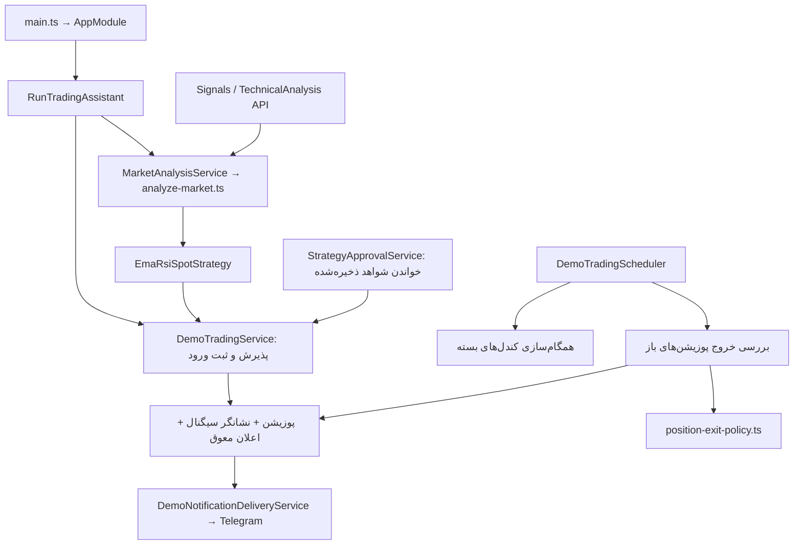

# نقشهٔ ساختار پروژه

این سند وضعیت فعلی کد را توضیح می‌دهد. `production` یعنی کدی که برنامهٔ فعال اجرا می‌کند؛ به معنی معاملهٔ واقعی یا اثبات سودآوری نیست. دمو بخشی از محصول فعال است و در production می‌ماند. شبیه‌سازی روی تاریخچه و استراتژی‌های تحقیقاتی در `test` قرار دارند.

رابطهٔ پوشه‌ها و مسیر اجرای آن‌ها در [نقشهٔ چرخهٔ production](PRODUCTION_CYCLE.md) آمده است. بررسی فعلی فایل جداافتاده یا پوشهٔ خالی پیدا نکرد؛ اتصال ماژول‌ها و exportهای بدون مصرف پاک‌سازی شدند.

```text
src/production/          برنامهٔ فعال
test/checks/             کنترل ساختار و تست‌های سازگاری
test/research/           بک‌تست، تحقیق و داده‌های تاریخی
operations/              نگهداری سرویس، ورود تاریخچه و migration
docs/                    تعریف جاری و نقشهٔ فایل‌ها
docs/archive/            یادداشت‌های تاریخی
```

## مسیر اجرای فعال



Production هیچ importی از `test` یا `operations` ندارد. تحقیق مجاز است هستهٔ production را بخواند تا همان قاعده را ارزیابی کند. `tsconfig.json` و `tsconfig.build.json` فقط production را می‌سازند؛ `test/tsconfig.json` تنظیم مستقل تحقیق و تست است. خروجی‌ها هم جدا هستند: `dist/production` و `dist-test`.

## فایل‌های production

مسیرهای جدول زیر نسبت به `src/production` هستند. فایل `*.module.ts` در هر بخش، اتصال سرویس‌ها، کنترلرها و وابستگی‌های همان بخش را به Nest تعریف می‌کند.

| فایل | مسئولیت |
| --- | --- |
| `main.ts` | شروع HTTP، اعتبارسنجی درخواست و shutdown |
| `app.module.ts` | اتصال ماژول‌های فعال، دیتابیس و زمان‌بندی |
| `assets/assets.module.ts` | ثبت اجزای مدیریت دارایی |
| `assets/assets.controller.ts` | API ایجاد، خواندن و تغییر دارایی‌ها |
| `assets/assets.service.ts` | عملیات دیتابیس دارایی و انتخاب دارایی فعال |
| `assets/entities/asset.entity.ts` | مدل جدول `asset` |
| `assets/dto/create-asset.dto.ts` | اعتبارسنجی ایجاد دارایی |
| `assets/dto/update-asset.dto.ts` | اعتبارسنجی تغییر دارایی |
| `assets/enums/asset-type.enum.ts` | نوع دارایی |
| `assets/enums/timeframe.enum.ts` | تایم‌فریم‌های شناخته‌شده |
| `assets/timeframe.utils.ts` | مدت هر تایم‌فریم برای بسته‌شدن کندل |
| `market-data/market-data.module.ts` | اتصال دریافت و ذخیرهٔ داده |
| `market-data/market-data.controller.ts` | API کندل بسته، کیفیت، sync و ترمیم داده |
| `market-data/market-data.service.ts` | ذخیرهٔ کندل بسته، sync، ترمیم، open برای fill و کندل بستهٔ دقیقه‌ای برای خروج |
| `market-data/market-data-provider.service.ts` | دریافت Kraken REST و تبدیل قالب آن |
| `market-data/market-candle-storage.service.ts` | خواندن و نوشتن کندل در دیتابیس |
| `market-data/market-data-quality.ts` | اعتبار OHLCV، پیوستگی، تازگی و انتخاب بخش پیوسته |
| `market-data/trading-symbol.ts` | نمادهای مجاز و pipe اعتبارسنجی نماد |
| `market-data/entities/market-candle.entity.ts` | مدل جدول `market_candle` |
| `risk/risk.module.ts` | ارائهٔ سرویس ریسک |
| `risk/risk-manager.service.ts` | محاسبهٔ SL، TP و نسبت ریسک/پاداش |
| `signals/signals.module.ts` | اتصال تحلیل و تنها استراتژی فعال |
| `signals/signals.controller.ts` | API سیگنال فعال |
| `signals/signals.service.ts` | گرفتن snapshot مشترک و تبدیل آن به سیگنال |
| `signals/strategy-registry.service.ts` | انتخاب نسخهٔ فعال؛ نسخه‌های تحقیقاتی را فعال نمی‌کند |
| `signals/signal.types.ts` | قرارداد دادهٔ سیگنال و تحلیل |
| `signals/technical-analysis.controller.ts` | API توضیح تحلیل بازار |
| `signals/technical-analysis.service.ts` | پاسخ تشخیصی از همان snapshot فعال |
| `trading/ema-rsi-spot.strategy.ts` | تبدیل نتیجهٔ EMA50/RSI14 به سیگنال با سطوح ریسک |
| `trading/ccxt/analyze-market.ts` | دریافت/اعتبارسنجی CCXT و هستهٔ تصمیم فقط روی کندل بسته |
| `trading/ccxt/market-analysis.service.ts` | cache کوتاه و ادغام درخواست‌های هم‌زمان تحلیل |
| `trading/ccxt/run-trading-assistant.ts` | حلقهٔ فعال؛ تنها مسئول ورود خودکار دمو |
| `trading/ccxt/trading-assistant.module.ts` | اتصال runner و API وضعیت |
| `trading/trade-execution.ts` | تطبیق سطوح با قیمت ورود و پذیرش هدف پس از هزینه |
| `trading/trade-outcome.ts` | موتور مشترک خروج؛ در دمو برای حفاظت سود قدیمی و در تحقیق برای replay |
| `trading/position-exit-policy.ts` | جدول کوچک سیاست خروج پوزیشن‌های ذخیره‌شدهٔ قدیمی |
| `trading/profit-protection.ts` | بالا بردن استاپ قدیمی با لحاظ سربه‌سر خالص |
| `trading/spot-position-sizing.ts` | مقدار معامله با بودجهٔ ریسک و سقف سرمایه |
| `trading/spot-trading-policy.ts` | محدودیت ورود اسپات به BUY |
| `trading/net-trade-result.ts` | WIN/LOSS/BREAKEVEN بر اساس نتیجهٔ خالص |
| `demo-trading/demo-trading.module.ts` | اتصال دمو، دیتابیس، مجوز و اعلان |
| `demo-trading/demo-trading.controller.ts` | API ورود دستی، پوزیشن باز، تاریخچه و خلاصه |
| `demo-trading/demo-trading.service.ts` | پذیرش سرمایه/هزینه، ثبت اتمیک ورود و reconciliation خروج |
| `demo-trading/demo-trading.scheduler.ts` | همگام‌سازی داده و پایش خروج هر دقیقه؛ ورود خودکار ندارد |
| `demo-trading/entities/demo-position.entity.ts` | مدل جدول `demo_position` و هزینهٔ ثبت‌شدهٔ معامله |
| `demo-trading/demo-position-result.ts` | بازسازی نتیجهٔ خالص پوزیشن از مقادیر ذخیره‌شده |
| `demo-trading/demo-notification-outbox.ts` | ذخیرهٔ پوزیشن و رویداد اعلان در یک تراکنش |
| `demo-trading/demo-notification-delivery.service.ts` | خواندن اعلان‌های معوق، ارسال و ثبت تحویل |
| `demo-trading/telegram-notification.service.ts` | قالب پیام و ارتباط HTTP با Telegram |
| `alerts/entities/alert-delivery.entity.ts` | مدل جدول `alert_delivery` برای نشانگر و صف پایدار |
| `strategy-approval/strategy-approval.module.ts` | اتصال خواندن شواهد به دمو |
| `strategy-approval/strategy-approval.service.ts` | بررسی شروط مجوز از نتیجه‌های قبلاً ذخیره‌شده؛ بک‌تست اجرا نمی‌کند |
| `strategy-approval/entities/strategy-evidence.entity.ts` | مدل همان جدول موجود `backtest_run`؛ نام جدول تغییر نکرده |
| `strategy-approval/evidence-result.ts` | قرارداد JSON ذخیره‌شده برای بررسی مجوز |
| `strategy-approval/evidence-trade.ts` | قرارداد معامله در شواهد ذخیره‌شده |
| `strategy-approval/evidence-capacity.ts` | بررسی ظرفیت هم‌زمان در شواهد پرتفوی |
| `strategy-approval/evidence-engine.ts` | شناسهٔ موتور سازگار برای قبول شواهد |

`strategy-approval` کد تست نیست: دمو برای تصمیم ورود به خواندن شواهد نیاز دارد. فقط قرارداد ذخیره و بررسی مجوز در production است؛ تولید آن شواهد در تحقیق انجام می‌شود. شناسه‌های نسخهٔ قدیمی در جدول سیاست خروج هم برای سازگاری با پوزیشن موجود هستند، نه برای فعال‌کردن استراتژی‌های قدیمی.

## فایل‌های تست و تحقیق

| مسیر نسبت به `test` | مسئولیت |
| --- | --- |
| `tsconfig.json` | typecheck/build مستقل تست، تحقیق و ابزارهای عملیاتی |
| `checks/check-structure.cjs` | رد import خارج از production و فایل production بدون مسیر استفاده |
| `checks/runtime-compatibility.test.ts` | سازگاری خروج قدیمی، fill محافظه‌کارانه، جدول شواهد و شروط مجوز |
| `checks/current-api.test.ts` | جلوگیری از ذخیرهٔ کندل باز در sync و کنترل فعال‌بودن دارایی |
| `checks/spot-exit-monitor.test.ts` | خروج دقیقه‌ای، gap/هزینه، اعتبار داده و ATR، فیلتر EMA و حفاظت سود |
| `checks/module-bootstrap.test.ts` | راه‌اندازی واقعی Nest با دیتابیس آفلاین؛ تطبیق ۱۹ route فعال و نبود سرویس تحقیق در محصول |
| `checks/verify-live-service.cjs` | بررسی خواندنی API و Telegram bot/chat؛ پیام نمی‌فرستد |
| `research/main.ts` | شروع سرور تحقیق محلی روی پورت 3001، بدون job و اعلان خودکار |
| `research/research.module.ts` | افزودن APIهای بک‌تست فقط به فرایند تحقیق |
| `research/backtesting/backtesting.module.ts` | اتصال موتور و استراتژی‌های تحقیقاتی |
| `research/backtesting/backtesting.controller.ts` | APIهای اجرای بک‌تست، تاریخچه، مقایسه و readiness |
| `research/backtesting/backtesting.service.ts` | replay تاریخی، تقسیم دوره‌ها، پرتفوی و walk-forward |
| `research/backtesting/backtest-response.schema.ts` | بررسی پاسخ بک‌تست |
| `research/backtesting/helpers/historical-entry.helper.ts` | ورود تاریخی در open کندل بعد با قاعدهٔ اجرای production |
| `research/backtesting/helpers/backtest-periods.helper.ts` | تقسیم training/validation/test/holdout |
| `research/backtesting/helpers/backtest-statistics.helper.ts` | آمار معاملات |
| `research/backtesting/helpers/backtest-summary.helper.ts` | خلاصهٔ هر دوره |
| `research/backtesting/helpers/portfolio-capacity.helper.ts` | خلاصه‌سازی معاملات پذیرفته‌شده با ظرفیت مشترک |
| `research/backtesting/helpers/portfolio-backtest.helper.ts` | جمع‌بندی بک‌تست بازارها |
| `research/backtesting/helpers/walk-forward.helper.ts` | ساخت پنجره‌های walk-forward |
| `research/backtesting/interfaces/*.ts` | قرارداد پاسخ پرتفوی و walk-forward |
| `research/strategies/trading-strategy.port.ts` | قرارداد ارزیابی تاریخی استراتژی |
| `research/strategies/ema-rsi-replay.strategy.ts` | adapter کندل تاریخی به هستهٔ فعلی EMA50/RSI14 |
| `research/strategies/research-strategy-registry.service.ts` | انتخاب صریح نسخه‌های تاریخی فقط برای تحقیق |
| `research/strategies/hourly-*.strategy.ts` | پنج استراتژی قدیمی و زنجیرهٔ لازم برای replay تاریخی |
| `research/strategies/technical-trend-engine.ts` | تحلیل روند مورد استفادهٔ نسخهٔ تاریخی v7 |
| `research/strategies/market-structure.ts` | pivot و مقاومت مورد استفادهٔ تحقیق |
| `research/data/kraken-hourly-csv.ts` | خواندن و اعتبارسنجی CSV رسمی و جداسازی فاصله‌ها |
| `research/indicators/indicators.module.ts` | اتصال اندیکاتورهای مورد استفادهٔ استراتژی‌های تاریخی |
| `research/indicators/indicators.service.ts` | محاسبات باقی‌ماندهٔ تاریخی EMA/RSI/ATR/ADX؛ در محصول بارگذاری نمی‌شود |
| `research/data/research-market-data.controller.ts` | درخواست صریح آماده‌سازی 4h فقط در سرور تحقیق |
| `research/data/research-market-data.service.ts` | ساخت و جایگزینی اتمیک 4h برای بک‌تست تاریخی |
| `research/data/higher-timeframe.ts` | نگاشت تایم‌فریم بالاتر برای استراتژی‌های تاریخی |
| `research/scripts/download-kraken-hourly-archive.py` | دریافت گزینشی CSVهای ساعتی BTC/EUR و ETH/EUR |
| `research/scripts/backtest-kraken-hourly-csv.ts` | اجرای detached بدون اتصال دیتابیس یا اعلان |
| `research/artifacts/kraken-history-2026-10-06/` | CSVها، رسید دانلود و نتیجهٔ مرجع بک‌تست |

## نگهداری و مستندات

`operations/scripts/import-kraken-hourly-csv.ts` تاریخچهٔ واقعی را با درخواست صریح وارد دیتابیس می‌کند. `inspect-project-service.py` پردازش‌های همین پروژه را پیدا می‌کند و `restart-audited-service.py` همان پردازش‌ها را جایگزین می‌کند. migration موجود در `operations/migrations` است. این ابزارها جزو build یا bootstrap محصول نیستند.

تعریف قاعدهٔ جاری در [STRATEGY.md](STRATEGY.md)، جزئیات تحلیل در [CCXT.md](CCXT.md) و قواعد نگهداری در [پروتکل](TRADING_ASSISTANT_PROJECT_PROTOCOL.md) است. فایل‌های `docs/archive` صرفاً سابقه‌اند.

## پاک‌سازی انجام‌شده

کد Hello World، seed مصنوعی، entity سیگنال ثبت‌نشده، ماژول اعلان قدیمی بدون اتصال به برنامه، متد تولید سیگنال قدیمی بدون فراخوان و port/token مربوط به آن حذف شدند. هشت متد اندیکاتور/امتیازدهی بدون استفاده، متدهای ذخیره‌سازی بدون فراخوان و helperهای متروک هم حذف شدند. endpoint بک‌فیل که همیشه خطا برمی‌گرداند کنار گذاشته شد؛ دانلود آرشیو و import صریح جای عملیات تاریخچه را مشخص می‌کنند.

بک‌تست از برنامهٔ فعال خارج شد. هیچ ردیف دیتابیس، پوزیشن یا اعلان معوق در این پاک‌سازی حذف نشد. کانسپت ورود و خروج معامله در این مرحله تغییر نکرد.

برای بررسی تغییر بعدی: `pnpm typecheck`، `pnpm typecheck:test`، `pnpm build` و `pnpm test`. CI همین بررسی‌ها را انجام می‌دهد.

در پاک‌سازی کنترلرها، اسکنر تکراری، APIهای تحلیل قدیمی، درج دستی کندل و
فهرست‌های کلی CRUD حذف شدند. محاسبات تاریخی و ساخت 4h فقط در تحقیق
ماندند. سرویس مجوز فقط شاخهٔ پرتفوی فعلی را دارد و query دارایی فعال
یکپارچه است. [فهرست کامل API و دلیل حفظ/حذف هر بخش](API.md) را ببینید.
