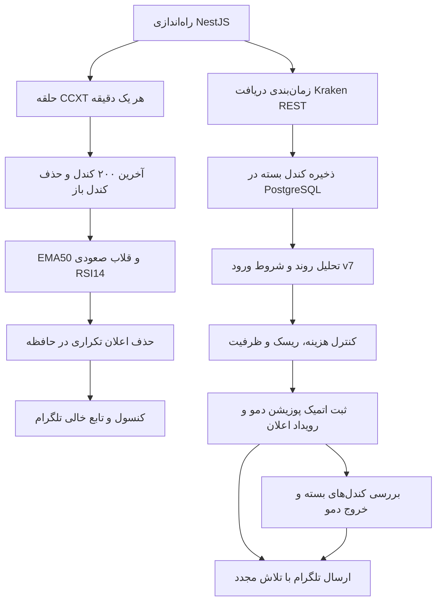

> سند تاریخی: مسیرها و توضیحات این فایل ممکن است منسوخ باشند. ساختار جاری در [STRUCTURE.md](../STRUCTURE.md) و تعریف جاری در [STRATEGY.md](../STRATEGY.md) است.

# گزارش جریان کامل Trading Assistant برای بازبینی

> یادداشت نسخه فعلی: مسیرهای زنده اکنون یکپارچه شده‌اند. تنها استراتژی فعال ccxt-ema50-rsi14-v1 است؛ API تحلیل/سیگنال، اسکنر، دمو و بک‌تست از یک هسته EMA50/RSI14 استفاده می‌کنند. فقط RunTradingAssistant مسئول ورود خودکار BTC و ETH است؛ زمان‌بند دمو صرفاً داده و خروج‌ها را مدیریت می‌کند. v7 تنها برای سوابق و سیاست خروج پوزیشن‌های قدیمی باقی است. متن پایین گزارش تاریخی پیش از ادغام است؛ تعریف جاری در STRATEGY.md و README.md آمده است.

تاریخ تهیه: ۵ اکتبر ۲۰۲۶. این گزارش رفتار کد و تنظیمات فعلی پروژه را توضیح می‌دهد؛ تضمین سودآوری یا صحت پیش‌بینی نیست. وضعیت اجرای زنده ممکن است بعد از این تاریخ تغییر کند. هیچ کلید، رمز دیتابیس یا اطلاعات محرمانه‌ای در گزارش قرار ندارد.

## ۱. هدف و وضعیت واقعی محصول

هدف، دستیار نیمه‌خودکار معاملات اسپات Kraken است: دریافت کندل، تحلیل، انتخاب ورود دارای SL و TP، بررسی هزینه و ظرفیت سرمایه، اعلان تلگرام و ثبت معامله آزمایشی. برنامه هیچ سفارش واقعی در صرافی ثبت نمی‌کند.

**در نسخه فعلی دو مسیر مستقل وجود دارد. تحلیل جدید CCXT به دمو متصل نیست.** بنابراین مشاهده BUY در مسیر CCXT لزوماً به ثبت خرید دمو یا پیام تلگرام منجر نمی‌شود و تصمیم دمو نیز لزوماً با آن یکسان نیست.

| مسیر | داده و تحلیل | خروجی فعلی |
|---|---|---|
| تحلیل جدید | CCXT، EMA50 و RSI14، BTC/EUR یک‌ساعته | نتیجه ساختاریافته، سیگنال کنسول، تابع خالی تلگرام |
| تحلیل و دمو موجود | Kraken REST، PostgreSQL، تحلیل روند 1h/4h و استراتژی v7 | تصمیم معاملاتی، SL/TP، دمو، مدیریت خروج و صف واقعی تلگرام |



## ۲. راه‌اندازی و اجزای پروژه

پروژه TypeScript با NestJS، TypeORM و PostgreSQL است. وابستگی‌های تحلیل جدید `ccxt` و `technicalindicators` هستند. ماژول‌های دارایی، داده بازار، اندیکاتور، سیگنال، ریسک، بک‌تست، اسکنر و دمو هنگام شروع برنامه بارگذاری می‌شوند.

پیکربندی از متغیرهای محیطی خوانده می‌شود. ورودی API با ValidationPipe بررسی می‌شود؛ فیلدهای اضافه پذیرفته نمی‌شوند. shutdown hook برای توقف منابع و حلقه CCXT فعال است. ساخت فعلی خروجی `dist/src/main.js` می‌دهد و `pnpm start:prod` آن را اجرا می‌کند.

جدول‌های اصلی عبارت‌اند از `asset`، `market_candle`، `demo_position`، `alert_delivery` و `backtest_run`. همگام‌سازی خودکار ساختار دیتابیس در تنظیم فعلی خاموش است. محاسبات سرمایه و ظرفیت در سرویس دمو و helperهای بک‌تست قرار دارند؛ ماژول مستقل portfolio در نسخه فعلی وجود ندارد.

اجرای یک نمونه سرویس فرض عملیاتی فعلی است؛ کنترل‌های درون حافظه، قفل توزیع‌شده میان چند پردازش نیستند.

## ۳. تنظیمات مؤثر فعلی

| تنظیم | مقدار |
|---|---|
| استراتژی فعال مسیر دمو | `research-hourly-integrated-spot-v7` |
| استراتژی تأییدشده | خالی؛ نسخه سودآور تأییدشده معرفی نشده |
| حلقه CCXT | فعال، فاصله پایه ۶۰٬۰۰۰ میلی‌ثانیه |
| دمو تأییدشده | خاموش |
| دمو آزمایشی | روشن؛ زمان شروع تنظیم‌شده ۲۰۲۶-۰۹-۲۷ |
| توقف ورودهای جدید | خاموش |
| سقف پوزیشن باز | ۲ |
| سرمایه اولیه دمو | ۱۰۰۰ یورو |
| سقف مبلغ هر ورود | ۱۰۰ یورو |
| بودجه ریسک هر ورود | ۱٪ سرمایه قابل استفاده |
| کارمزد فرضی هر سمت | ۰٫۰۵٪ |
| لغزش فرضی هر سمت | ۰٫۰۵٪ |
| همگام‌سازی ساختار دیتابیس | خاموش |

این هزینه‌ها فرض تنظیماتی‌اند؛ با تعرفه واقعی حساب Kraken تطبیق داده نشده‌اند. استفاده از آن‌ها معادل تأیید هزینه واقعی معامله نیست. بازه holdout در صورت نبود تنظیم صریح، پیش‌فرض ۳۶۵ روز دارد.

## ۴. دریافت داده و تفاوت مهم ساختار کندل‌ها

مسیر CCXT از نماد یکپارچه `BTC/EUR` استفاده می‌کند. مسیر دیتابیس نمادهایی مانند `BTCEUR` و `ETHEUR` دارد و provider آن‌ها را به نام بازار Kraken تبدیل می‌کند.

دو آرایه ورودی یکسان نیستند:

```text
CCXT:       [timestamp_ms, open, high, low, close, volume]
Kraken REST:[timestamp_s,  open, high, low, close, vwap, volume, count]
```

پس حجم CCXT اندیس ۵، حجم Kraken خام اندیس ۶ است. زمان Kraken خام به میلی‌ثانیه تبدیل می‌شود. اشتباه گرفتن این دو قالب، اندیکاتور و تحلیل حجم را خراب می‌کند.

Provider موجود Kraken تا ۷۲۰ کندل اخیر می‌گیرد؛ timeout ده ثانیه و حداکثر سه تلاش برای خطاهای قابل تکرار دارد. کندل باز وارد تاریخچه بسته نمی‌شود. ذخیره‌سازی با کلید بازار، تایم‌فریم و زمان شروع کندل از تکرار جلوگیری می‌کند.

کندل 4h از چهار کندل 1h یک گروه زمانی UTC ساخته می‌شود: open اولین، close آخرین، بیشترین high، کمترین low و مجموع حجم. گروه ناقص تولید نمی‌شود؛ کنترل کیفیت بعدی پیوستگی تاریخچه را نیز بررسی می‌کند.

ترمیم فاصله‌ها به پنجره اخیر API وابسته است. دریافت اخیر ۷۲۰ کندل راه‌حل عمومی برای فاصله بسیار قدیمی نیست؛ ورود تاریخچه آرشیوی ابزار جداگانه دارد.

## ۵. مسیر جدید analyzeMarket، قدم به قدم

فایل: `src/trading/ccxt/analyze-market.ts`.

۱. بازارها بارگذاری می‌شوند و پشتیبانی OHLCV، تایم‌فریم، فعال بودن بازار و spot بودن بررسی می‌شود.

۲. آخرین ۲۰۰ ردیف دریافت می‌شود. کندل‌هایی که زمان پایانشان هنوز نرسیده کنار گذاشته می‌شوند؛ معمولاً از ۲۰۰ ردیف دریافتی، ۱۹۹ کندل بسته باقی می‌ماند.

۳. timestamp و OHLCV بسته بررسی می‌شوند: مقادیر باید عدد معتبر باشند، قیمت مثبت باشد، حجم منفی نباشد و high/low با open/close سازگار باشد. داده به ترتیب زمانی مرتب می‌شود؛ فاصله یا timestamp تکراری موجب رد تحلیل است.

۴. حداقل ۵۰ کندل بسته لازم است. آخرین کندل باید تازه باشد؛ داده قدیمی سیگنال خرید نمی‌سازد.

۵. EMA50 و RSI14 فقط از closeهای زمانی صعودی محاسبه می‌شوند. طول و اعتبار خروجی بررسی می‌شود. آخرین مقدار خروجی اندیکاتور به آخرین کندل متصل است؛ کوتاه‌تر بودن آرایه خروجی به‌دلیل warmup با اندیس خام کندل اشتباه گرفته نمی‌شود.

۶. خرید به دو شرط هم‌زمان نیاز دارد:

- close آخرین کندل بسته بالاتر از EMA50 باشد.
- RSI قبلی کمتر از ۳۵، RSI فعلی بیشتر از قبلی، و RSI قبلی کمتر یا مساوی RSI دو کندل قبل باشد. در همین دوره اشباع فروش باید یک مقدار قبلی حداقل ۳۵ دیده شده باشد تا ورود به ناحیه زیر ۳۵ واقعاً مشاهده شده باشد.

این شرط «شروع برگشت RSI» است؛ RSI فعلی الزامی ندارد از ۳۵ بالاتر برود. افزایش ادامه‌دار RSI در هر کندل سیگنال تازه نمی‌سازد، اما یک چرخش تازه دیگر در همان دوره می‌تواند واجد شرط شود.

۷. خروجی شامل `shouldBuy`، دلیل، کندل ارزیابی‌شده، EMA، RSI و تعداد کندل بسته است. `result.candle.timestamp` **زمان شروع کندل بسته** است. داده نامعتبر یا خطای دریافت، نتیجه خرید false و دلیل مشخص می‌دهد.

این تابع روند آینده کندل بعدی را تضمین نمی‌کند و SL، TP، هزینه، سرمایه و سود مورد انتظار محاسبه نمی‌کند؛ صرفاً یک الگوی تکنیکال را شناسایی می‌کند.

## ۶. اجرای حلقه و جلوگیری از اعلان تکراری

فایل: `src/trading/ccxt/run-trading-assistant.ts`، کلاس `RunTradingAssistant`.

پس از start، یک تحلیل فوری انجام می‌شود. اجرای بعدی با setTimeout پس از تمام شدن اجرای قبلی برنامه‌ریزی می‌شود؛ فاصله واقعی برابر زمان تحلیل به‌علاوه فاصله تنظیم‌شده است. guard مانع هم‌پوشانی اجرای همین نمونه می‌شود. stop و generation token مانع انتشار نتیجه قدیمی پس از توقف/شروع مجدد هستند.

برای BUY، timestamp در Set ثبت و رویداد JSON در کنسول نوشته می‌شود. حداکثر ۱۰۰ timestamp نگه داشته می‌شود. `sendTelegramAlert(reason, indicators)` فعلاً تابع خالی است.

timestamp **قبل از ارسال** ثبت می‌شود؛ بنابراین شکست ارسال در همان پردازش دوباره تلاش نمی‌شود. با restart، حافظه پاک می‌شود و همان کندل ممکن است دوباره اعلان شود. این مسیر صف پایدار یا تضمین تحویل ندارد.

`GET /trading-assistant/status` وضعیت حلقه، آخرین تحلیل، خطا و اندازه cache را نشان می‌دهد. فعال بودن حلقه به‌تنهایی سلامت داده نیست؛ دلیل آخرین تحلیل نیز باید بررسی شود.

## ۷. تحلیل روند در مسیر دیتابیس

مدل `technical-trend-v1` وضعیت فعلی بازار را با EMA20، EMA50، تغییر آن‌ها طی پنج کندل، ATR14، RSI14، DI/ADX و ساختار pivotهای تأییدشده توضیح می‌دهد. pivot با دو کندل سمت راست تأیید می‌شود؛ نقطه‌ای که هنوز تأیید نشده نباید وارد تصمیم همان زمان شود.

روند صعودی زمانی است که close بالاتر از EMA50 و EMA50 بالاتر از مقدار پنج کندل قبل باشد، و یکی از این‌ها برقرار باشد: ساختار سقف/کف صعودی معتبر، یا EMA20 بالاتر از EMA50 و در حال افزایش همراه با +DI بیشتر از −DI. حالت نزولی متناظر است؛ سایر وضعیت‌ها خنثی هستند.

فازهای ادامه حرکت، اصلاح، رنج و گذار جدا می‌شوند. ADX قدرت روند را توصیف می‌کند، نه جهت آن. خروجی 1h و 4h برای تشخیص هم‌جهتی یا تضاد ترکیب می‌شود. این برچسب‌ها شرح شواهد گذشته و اکنون‌اند؛ هنوز اندازه‌گیری معتبر «درصد پیش‌بینی صحیح کندل آینده» نداریم.

## ۸. تعریف ورود استراتژی فعلی دمو، v7

فایل: `src/trading/hourly-integrated-spot-research.strategy.ts` و زنجیره والدهای آن.

حداقل تاریخچه اصلی ۲۰۱ کندل و تاریخچه بالاتر ۵۵ کندل است. داده بسته، پیوسته و تازه لازم است. تأیید 4h فقط از کندل‌هایی می‌آید که در زمان تصمیم 1h بسته شده‌اند.

ورود تمام شروط زیر را لازم دارد:

- تشخیص 1h صعودی و فاز ADVANCING؛ تشخیص 4h صعودی.
- در سه کندل قبل، تماس با EMA20 همان زمان دیده شده باشد.
- کندل آخر صعودی باشد، بالاتر از high کندل قبل و EMA20 بسته شود.
- RSI14 حداقل ۴۰ و نسبت به قبلی افزایشی باشد.
- حجم کندل آخر از بیشترین حجم سه کندل قبل بیشتر باشد.
- سطوح ساختاری و کنترل‌های ریسک/هزینه نیز عبور کنند.

این تعریف با شرط RSI زیر ۳۵ در CCXT متفاوت است. کم بودن تعداد BUY می‌تواند از هم‌زمانی همین فیلترها باشد؛ تعداد کم به‌تنهایی اثبات درستی یا خرابی تحلیل نیست. لازم است دلیل رد هر فیلتر و فرصت‌های ازدست‌رفته مستقلاً بررسی شوند.

## ۹. SL، TP و پذیرش اقتصادی دمو

زنجیره استراتژی ابتدا سطوح ریسک را بررسی می‌کند. استاپ ساختاری با کف چهار کندل اخیر و حاشیه ۰٫۱۵ATR، و فاصله پایه ۱٫۵ATR ساخته می‌شود. فاصله ریسک نباید از ۳ATR یا ۱٫۵٪ قیمت ورود بیشتر باشد.

هدف پایه برابر ورود به‌علاوه کمینه ۲ برابر ریسک، ۴ATR و ۱٫۵٪ قیمت ورود است؛ مقاومت تأییدشده می‌تواند آن را پایین‌تر محدود کند. هدف صرفاً برای پوشاندن هزینه بالا برده نمی‌شود.

حداقل نسبت پاداش ناخالص به ریسک ۰٫۷۵ و نسبت خالص پس از هزینه‌های دو سمت به ریسک ۰٫۵ است. مثبت بودن هدف خالص دوباره با قیمت ورود بررسی می‌شود. این شرط سود بالقوه در صورت رسیدن به TP است؛ احتمال رسیدن به TP را محاسبه نمی‌کند.

## ۱۰. زمان‌بندی و ثبت خرید دمو

اسکنر هر ۱۵ دقیقه اجرا می‌شود. چرخه دمو در ثانیه ۱۰ همان مرزهای ۱۵ دقیقه اجرا می‌شود و guard هم‌پوشانی دارد. تصمیم ورود 1h در مرز ساعتی گرفته می‌شود؛ پایش خروج هر ۱۵ دقیقه انجام می‌شود.

چرخه دمو ابتدا داده بازارهای فعال و بازارهای دارای پوزیشن باز را همگام می‌کند، سپس خروج‌ها را بررسی می‌کند و بعد سراغ ورود می‌رود. فعال بودن دمو آزمایشی جای تأیید سودآوری را نمی‌گیرد. حالت تأییدشده نیازمند شروط readiness و تطبیق نسخه تأییدشده است؛ حالت آزمایشی مجوز ورود جداگانه دارد.

ورود جدید در صورت توقف ورودها، تکمیل ظرفیت دو پوزیشن، وجود پوزیشن باز همان بازار/تایم‌فریم، نبود BUY معتبر یا ریسک نامناسب رد می‌شود. سیستم spot-long-only است؛ SELL سیگنال باز کردن موقعیت فروش استقراضی نیست.

سیگنال با کندل بسته ساخته می‌شود و قیمت ورود از open کندل بعدی Kraken خوانده می‌شود. کندل باز برای این قیمت خوانده می‌شود ولی وارد تاریخچه تحلیل بسته نمی‌شود. این fill یک شبیه‌سازی است، نه معامله واقعی؛ انتشار دیرهنگام قیمت یا عبور قیمت از سطوح می‌تواند ورود را رد کند. سطوح و هزینه پس از مشخص شدن ورود دوباره بررسی می‌شوند.

حجم معامله کمینه حجم مجاز از بودجه ریسک و سقف سرمایه است. سرمایه قابل استفاده، سود/زیان تحقق‌یافته و مبلغ و هزینه رزروشده پوزیشن‌های باز را لحاظ می‌کند. مقدار دارایی تا هشت رقم اعشار پایین گرد می‌شود. محدودیت واقعی lot، spread و دقت سفارش صرافی به این معنی اجرا نشده است.

پوزیشن و رویداد اعلان OPEN در یک تراکنش ذخیره می‌شوند. قید یکتایی نسخه/بازار/تایم‌فریم/زمان ورود از ثبت دوباره همان ورود جلوگیری می‌کند. صف داخلی mutation عملیات همین نمونه را سری می‌کند.

## ۱۱. خروج، هزینه و سود/زیان دمو

پوزیشن با کندل‌های بسته معتبر و پیوسته از زمان ورود بررسی می‌شود. در صورت فاصله داده، برنامه نتیجه خروج را از روی کندل‌های ناقص حدس نمی‌زند. پوزیشن ممکن است تا ترمیم داده باز بماند.

اگر در یک کندل هم SL و هم TP لمس شوند، ترتیب داخل کندل معلوم نیست و حالت محافظه‌کارانه، استاپ، انتخاب می‌شود. gap زیر استاپ می‌تواند خروج بدتر در open ایجاد کند.

profit protection بعد از رسیدن close به نیمه مسیر هدف، با لحاظ نقطه سربه‌سر خالص می‌تواند استاپ را بالا ببرد. استاپ جدید از کندل بعد اثر دارد؛ برای همان کندلی که آن را ساخته به گذشته اعمال نمی‌شود. سیاست v7 پس از حداکثر ۲۴ کندل می‌تواند TIME_EXIT ایجاد کند.

هزینه پوزیشن از مقادیر ذخیره‌شده هنگام ورود بازسازی می‌شود؛ تغییر تنظیم هزینه نباید معاملات باز قبلی را بازقیمت‌گذاری کند. سود خالص، ارزش خروج منهای مبلغ ورود و کارمزد و لغزش هر دو سمت است. WIN/LOSS بر مبنای نتیجه خالص تعیین می‌شود. زمان ثبت بسته‌شدن، پایان کندل خروج است.

بسته‌شدن پوزیشن و رویداد CLOSE نیز اتمیک ذخیره می‌شوند. استاپ دمو، سفارش محافظتی واقعی در Kraken نیست؛ مدیریت مبتنی بر کندل بسته می‌تواند با اجرای واقعی تفاوت اساسی داشته باشد.

**نکته عملیاتی:** خاموش کردن هر دو فلگ دمو، کل چرخه دمو را قبل از پایش خروج متوقف می‌کند. برای توقف خرید جدید و ادامه پایش، فلگ `DEMO_ENTRIES_PAUSED` کاربرد متفاوتی دارد.

## ۱۲. تلگرام واقعی مسیر دمو

رویدادهای PENDING/SENT در جدول `alert_delivery` نگه داشته می‌شوند. dispatcher هر دقیقه در ثانیه ۲۵ حداکثر ۱۰۰ رویداد منتظر را بررسی می‌کند. تنها پس از پاسخ موفق HTTP و `ok=true` تلگرام، تحویل ثبت می‌شود؛ شکست برای تلاش بعد باقی می‌ماند.

این مسیر بعد از restart قابل بازیابی است. بااین‌حال اگر تلگرام پیام را قبول کند و پردازش قبل از ثبت SENT قطع شود، ارسال دوباره ممکن است؛ تضمین دقیقاً یک بار وجود ندارد. در حضور دمو، اسکنر اعلان مقدماتی ورود را کنار می‌گذارد تا رویداد ثبت‌شده دمو مبنای اعلان باشد.

این سازوکار با Set حافظه‌ای CCXT و تابع خالی آن متفاوت است.

## ۱۳. بک‌تست و میزان شواهد موجود

ماژول محصولی بک‌تست، تاریخچه اجراها، readiness، مقایسه، portfolio و walk-forward باقی مانده‌اند. موتور بسته‌بودن داده، ورود در open بعدی، هزینه، محدودیت ظرفیت و ابهام برخورد SL/TP را لحاظ می‌کند. وجود این امکانات به معنی عبور نسخه فعلی از اعتبارسنجی نیست.

در بررسی تاریخی قبلی، روی ۱۳۷۴ تصمیم قابل استفاده برای v7، ۸ رویداد مستقل BUY و در شبیه‌سازی متوالی ۶ معامله گزارش شد: ۴ برد، ۲ باخت، جمع خالص حدود منفی ۱٫۴۴ یورو با مبلغ ۱۰۰ یورو و هزینه‌های فرضی آن اجرا. این اعداد گزارش اجرای قبلی‌اند؛ نتیجه بک‌تست تازه یا نتیجه استراتژی CCXT نیستند. شمار برد بیشتر از باخت نیز به‌تنهایی سودآوری را ثابت نمی‌کند.

برای قاعده جدید EMA50/RSI14، سودآوری تأییدشده یا ارزیابی خارج از نمونه ارائه نشده است. confidence احتمالاتی کالیبره‌شده نیز نداریم.

طبق درخواست پاک‌سازی، فایل‌های تحقیق، ابزارهای آزمایشی بلااستفاده، تست‌های واحد/e2e و وابستگی‌های تست حذف شدند. مشاهده‌گر خودکار تحقیق و گزارش‌های فایل‌محور آن دیگر وجود ندارند. کلاس‌های دارای نام research که والد v7 یا لازم برای شناخت سیاست نسخه‌های قدیمی‌اند باقی مانده‌اند.

پیش از پاک‌سازی ۲۲۲ تست در ۴۴ مجموعه عبور کردند. پس از پاک‌سازی typecheck/build، تطبیق تصمیم‌های تاریخی v7 و بررسی چند API انجام شد. **در مخزن فعلی مجموعه تست خودکار نداریم؛ CI فقط بررسی TypeScript و build می‌کند.** این شواهد تضمین نبود باگ یا نبود regression در تغییرات آینده نیستند.

## ۱۴. موارد مشخصی که بازبین باید بررسی کند

۱. آیا محصول باید یک مسیر تصمیم واحد داشته باشد؟ اتصال CCXT به دمو هنوز انجام نشده و هر مسیر تعریف ورود متفاوت دارد.

۲. آیا همه فیلترهای v7 توجیه و ارزش افزوده دارند؟ برای هر شرط، تعداد رد، فرصت ازدست‌رفته و نتیجه خارج از نمونه بررسی شود؛ افزایش تعداد BUY هدف مستقل نیست.

۳. آیا برچسب روند فقط برای توصیف اکنون کافی است یا پیش‌بینی کندل آینده لازم است؟ برای پیش‌بینی باید label، افق زمانی و معیار ارزیابی مستقل تعریف شود؛ رنگ کندل بعدی با سود معامله یکی نیست.

۴. کارمزد واقعی، spread، لغزش و سقف ۱٫۵٪ هدف با هم سازگارند؟ هزینه تنظیم‌شده فعلی نباید به‌عنوان تعرفه حساب واقعی فرض شود.

۵. راهبرد آزمون رگرسیون پس از حذف تست‌ها چیست؟ موارد حساس شامل نگاشت OHLCV، زمان‌بندی بسته‌شدن، عدم استفاده از آینده، rebasing ورود، برخورد هم‌زمان SL/TP و retry اعلان‌اند.

۶. در حلقه CCXT، ثبت timestamp قبل از ارسال و پاک شدن cache با restart رفتار مطلوب است؟ ارسال واقعی و سیاست retry هنوز تکمیل نشده‌اند.

۷. چرخه اسکنر و چرخه دمو ممکن است در دریافت/بازسازی داده هم‌زمان شوند؛ guard دمو جای بررسی concurrency کل سیستم را نمی‌گیرد. اجرای چند نمونه به بررسی قفل/claim دیتابیس نیاز دارد.

۸. تحلیل هنگام بررسی ورود در scheduler و هنگام ثبت پوزیشن دوباره انجام می‌شود؛ سازگاری timestamp و snapshot تصمیم باید بررسی شود.

۹. وقفه داده، دیر رسیدن open و خاموش کردن فلگ‌های دمو چه اثری بر پوزیشن باز دارند؟ توقف ورود و توقف مدیریت خروج باید در بهره‌برداری تفکیک شوند.

۱۰. APIهای عملیاتی باید از نظر احراز هویت، کنترل دسترسی و محل انتشار بررسی شوند. ValidationPipe جای احراز هویت را نمی‌گیرد؛ این گزارش ادعای دسترسی عمومی فعلی نمی‌کند.

۱۱. اعلان outbox تحویل حداقل یک بار دارد؛ محتوای اعلان معوق و تغییر وضعیت پوزیشن بین ثبت رویداد و ارسال نیز بررسی شود.

۱۲. مدل fill دمو با اجرای واقعی یکسان نیست. قبل از هر اتصال سفارش واقعی، دقت دارایی، حداقل سفارش، نقدشوندگی، حفاظت خروج و تطبیق حساب باید طراحی و آزموده شود.

موارد بالا ترکیبی از محدودیت‌های قطعی و موضوعات نیازمند ممیزی‌اند؛ همه آن‌ها ادعای باگ اثبات‌شده نیستند.

## ۱۵. نقشه فایل‌ها برای بازبین

| موضوع | فایل‌های اصلی |
|---|---|
| شروع و ماژول‌ها | `src/main.ts`، `src/app.module.ts` |
| تحلیل CCXT | `src/trading/ccxt/analyze-market.ts` |
| حلقه، cache و placeholder | `src/trading/ccxt/run-trading-assistant.ts` |
| فعال‌سازی و status | `src/trading/ccxt/trading-assistant.module.ts` |
| Kraken و ذخیره داده | `src/market-data/market-data-provider.service.ts`، `market-data.service.ts`، `market-candle-storage.service.ts` |
| کیفیت داده | `src/market-data/market-data-quality.ts` |
| روند | `src/trading/technical-trend-engine.ts`، `src/signals/technical-analysis.service.ts` |
| انتخاب نسخه و تصمیم | `src/signals/strategy-registry.service.ts`، `signals.service.ts` |
| ورود v7 | `src/trading/hourly-integrated-spot-research.strategy.ts` و والدهای hourly آن |
| حجم و هزینه | `src/trading/spot-position-sizing.ts`، `net-trade-result.ts` |
| حفاظت سود | `src/trading/profit-protection.ts` |
| دمو و زمان‌بندی | `src/demo-trading/demo-trading.service.ts`، `demo-trading.scheduler.ts` |
| صف و ارسال تلگرام | `src/demo-trading/demo-notification-outbox.ts`، `demo-notification-delivery.service.ts`، `telegram-notification.service.ts` |
| بک‌تست | `src/backtesting/backtesting.service.ts` و `helpers/` |
| بررسی سرویس | `scripts/inspect-project-service.py`، `scripts/verify-live-service.cjs` |

برای بررسی اولیه: `pnpm typecheck` و `pnpm build`. endpointهای خواندنی مهم: `/trading-assistant/status`، `/technical-analysis/BTCEUR`، `/signals/BTCEUR/1h`، `/demo-trading/open` و `/demo-trading/summary`.

خروجی مطلوب بازبین: یافته‌ها را با مسیر فایل، شرط یا سناریوی بازتولید، اثر بر تصمیم/سرمایه/اعلان، و اصلاح پیشنهادی مشخص کند. «مشکل پیاده‌سازی»، «محدودیت مدل»، «فرض اقتصادی» و «کمبود شواهد» جدا گزارش شوند تا اصلاح مرحله بعد دقیق باشد.
